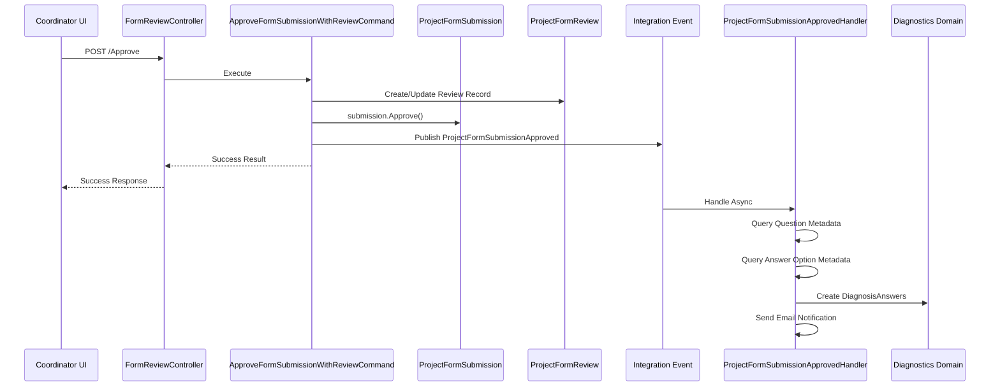

# Form Approval and Diagnostics Domain Integration

> **Priority**: P1  
> **Module**: BusinessIncubator/Diagnostics/Orchestration  
> **Estimate**: Medium  
> **Status**: Pending  
> **Branch**: feature/form-approval-diagnostics  

## Summary
Fix the form approval workflow to properly approve submissions, update their status, and integrate with the Diagnostics domain to create diagnosis answers with complete metadata (FODA, ODSR, scores).

## Business Context
Currently, when a coordinator approves a form submission through the review interface, the approval action only creates a review record but doesn't actually approve the submission or trigger the downstream processes. This breaks the workflow as:
- Form submissions remain in "Submitted" status even after approval
- Diagnosis answers are not created in the Diagnostics domain
- Participants don't progress to the next stage of their journey
- The system cannot generate diagnosis reports or mentoring plans

## Acceptance Criteria
- [ ] Clicking "Approve" in `/Coordination/FormReview/Review/{id}` changes submission status to "Approved"
- [ ] Approval creates both a ProjectFormReview record (audit trail) and updates ProjectFormSubmission
- [ ] Integration event `ProjectFormSubmissionApproved` is published with complete data
- [ ] DiagnosisAnswers are created in Diagnostics domain with all metadata (FODA, ODSR, scores)
- [ ] Participant receives email notification about approval
- [ ] UI shows confirmation and prevents re-approval of already approved forms
- [ ] System correctly identifies the phase (Start/Final) from the submission
- [ ] All answer option metadata is properly retrieved and stored

## Technical Requirements

### Domain Layer

#### BusinessIncubator Domain
- **ProjectFormSubmission**: Already has `Approve()` method - no changes needed
- **ProjectFormReview**: Already exists for audit trail - no changes needed
- **Integration Event**: `ProjectFormSubmissionApproved` already exists - review for completeness

#### Diagnostics Domain
- **UserProjectDiagnosis**: Already has `AddOrUpdateAnswersFromApprovedSubmission()` - no changes needed
- **DiagnosisAnswerInput**: Review structure to ensure all fields can be populated

### Application Layer

#### Commands to Create/Modify
1. **ApproveFormSubmissionWithReviewCommand**
   ```csharp
   public record ApproveFormSubmissionWithReviewCommand(
       long ProjectId,
       long SubmissionId,
       string ApproverUserId,
       string? Comments) : IBaseRequest;
   ```
   - Combines review creation with actual approval
   - Ensures transactional consistency
   - Publishes integration event

2. **Remove/Deprecate**
   - `ApproveSubmissionCommand` (only creates review, doesn't approve)

#### Queries to Add
1. **GetQuestionMetadataQuery**
   ```csharp
   public record GetQuestionMetadataQuery(
       long ProjectId,
       QuestionPhase Phase,
       List<long> QuestionIds) : IBaseRequest<Dictionary<long, QuestionMetadataDto>>;
   ```

2. **GetAnswerOptionMetadataQuery**
   ```csharp
   public record GetAnswerOptionMetadataQuery(
       List<long> AnswerOptionIds) : IBaseRequest<Dictionary<long, AnswerOptionMetadataDto>>;
   ```

#### DTOs Required
```csharp
public class QuestionMetadataDto
{
    public long QuestionId { get; set; }
    public string QuestionText { get; set; }
    public bool IsUsedForDiagnosis { get; set; }
    public bool IsUsedForMentoringPlan { get; set; }
    public List<AnswerOptionMetadataDto> AnswerOptions { get; set; }
}

public class AnswerOptionMetadataDto
{
    public long AnswerOptionId { get; set; }
    public string AnswerText { get; set; }
    public int Score { get; set; }
    public FodaType? Foda { get; set; }
    public string? FodaExplanation { get; set; }
    public OdsrType? Odsr { get; set; }
    public string? OdsrExplanation { get; set; }
}
```

### Infrastructure Layer

#### Repository Methods Needed
In `IBusinessIncubatorRepository`:
```csharp
Task<Dictionary<long, ProjectQuestion>> GetProjectQuestionsWithAnswerOptionsAsync(
    long projectId, 
    QuestionPhase phase, 
    CancellationToken cancellationToken);

Task<List<ProjectAnswerOption>> GetAnswerOptionsByIdsAsync(
    List<long> answerOptionIds, 
    CancellationToken cancellationToken);
```

#### Database Changes
None required - all tables and relationships already exist.

### Web Layer

#### Controller Modifications
**FormReviewController.Approve**:
```csharp
[HttpPost]
[Route("Approve")]
public async Task<IActionResult> Approve([FromBody] ApproveRequest request, CancellationToken cancellationToken)
{
    // Get current context for project ID
    TryGetCurrentUserContext(out var contextResult);
    var projectId = contextResult!.ProjectId!.Value;
    
    var command = new ApproveFormSubmissionWithReviewCommand(
        projectId,
        request.SubmissionId,
        CurrentUserId,
        request.Comments);
    
    var result = await mediatorExecutor.SendAndLogIfFailureAsync(command, cancellationToken);
    
    if (result.IsFailure)
    {
        return BadRequest(new { errors = result.ErrorMessages?.Select(e => e.Message) ?? ["Error al aprobar el formulario."] });
    }
    
    return Ok(new
    {
        success = true,
        message = "Formulario aprobado exitosamente. El participante ha sido notificado.",
        redirectUrl = Url.Action("Index", "FormReview", new { area = "Coordination" })
    });
}
```

### Orchestration Layer

#### Enhanced Integration Event Handler
**ProjectFormSubmissionApprovedHandler** modifications:
1. Query question metadata before processing answers
2. Extract phase from submission data
3. Map complete metadata to DiagnosisAnswerInput
4. Handle both single-choice and multi-choice answers correctly

## Data Flow



## API Endpoints
```
POST   /Coordination/FormReview/Approve
{
    "submissionId": 123,
    "comments": "Optional approval comments"
}
```

## Testing Requirements

### Unit Tests
- [ ] ApproveFormSubmissionWithReviewCommand handler
- [ ] Question metadata query handler
- [ ] Answer option metadata query handler
- [ ] Integration event handler with complete metadata

### Integration Tests
- [ ] End-to-end approval flow
- [ ] Verify ProjectFormSubmission status change
- [ ] Verify ProjectFormReview creation
- [ ] Verify DiagnosisAnswers creation with metadata
- [ ] Verify email notification sent

### E2E Scenarios
1. Submit form as participant
2. Review as coordinator with feedback
3. Approve with comments
4. Verify diagnosis created
5. Verify participant can see approved status

## Security Considerations
- [ ] Only coordinators can approve submissions
- [ ] Cannot approve own submissions
- [ ] Cannot re-approve already approved submissions
- [ ] Audit trail maintained for all approvals
- [ ] Comments sanitized to prevent XSS

## Documentation Updates
- [ ] Update CLAUDE.md with approval workflow pattern
- [ ] Add to common-issues.md if approval fails
- [ ] Document integration event flow in architecture.md
- [ ] Update domain-reference.md with new repository methods

## Implementation Notes

### Critical Points
1. **Transaction Boundary**: Review creation and submission approval must be in same transaction
2. **Phase Detection**: Extract from ProjectFormSubmission.Phase, not hardcoded
3. **Metadata Completeness**: All FODA, ODSR, scores must be retrieved from ProjectAnswerOption
4. **Error Handling**: Don't fail approval if email fails (log warning only)
5. **Idempotency**: Check if already approved before processing

### Code Examples

#### Correct Command Handler Pattern
```csharp
public class ApproveFormSubmissionWithReviewCommandHandler : BaseCommandHandler<ApproveFormSubmissionWithReviewCommand>
{
    public override async Task<Result> Handle(ApproveFormSubmissionWithReviewCommand request, CancellationToken cancellationToken)
    {
        // 1. Get project with submissions
        var project = await repository.GetProjectWithFormSubmissionsAsync(request.ProjectId, cancellationToken);
        
        // 2. Get submission
        var submission = project.GetFormSubmission(request.SubmissionId);
        
        // 3. Check if already approved
        if (submission.Status == ProjectFormSubmissionStatus.Approved)
        {
            return Success(); // Idempotent
        }
        
        // 4. Create/update review record
        var review = await repository.GetReviewBySubmissionIdAsync(request.SubmissionId, cancellationToken)
            ?? new ProjectFormReview(/*...*/);
        
        // 5. Approve submission
        submission.Approve(request.ApproverUserId, timeProvider.UtcNow);
        
        // 6. Save changes
        await repository.UpdateAsync(project, cancellationToken);
        await repository.UnitOfWork.SaveChangesAsync(cancellationToken);
        
        // 7. Publish event
        var integrationEvent = new ProjectFormSubmissionApproved(/*...*/);
        await mediator.Publish(integrationEvent, cancellationToken);
        
        return Success();
    }
}
```

## Definition of Done
- [ ] Code implemented following DDD patterns
- [ ] All tests written and passing
- [ ] StyleCop compliance verified (0 warnings)
- [ ] Integration event handler enriched with metadata
- [ ] Email notifications working
- [ ] UI shows proper feedback after approval
- [ ] Diagnosis answers created with complete metadata
- [ ] Documentation updated

## Follow-up Tasks
- Implement rejection workflow with reason tracking
- Add bulk approval for multiple submissions
- Create dashboard showing approval statistics
- Implement approval delegation/escalation
- Add configurable approval rules per project stage